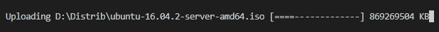

# SharePoint: Large files upload example using PnPjs from Node.js

## Supported SharePoint versions

- SharePoint Online
- SharePoint On-Prem (2019/2016)

## Dependencies

```bash
npm run install
```
## Test

Replace `./test/ReplaceWithLargeOne.avi` with a large file to upload to SHarePoint.

In a console, run the following command:

```bash
npm run test
```

Provide SharePoint credentials during first execution.



## Upload method

PnPjs's `.addChunked` API implementation is used for uploading a large document in chunks.

## Authentication

A variety of different authentication strategies are covered using `node-sp-auth` library.

`pnp-auth` Node.js fetch client is used to proxy all available auth strategies.

## Usage sample

```typescript
const filePath = './file-path.ext';
const folderUrl = 'Shared Documents';
// context - authentication context, see `./test/upload.test.ts` for more details

const upload = new Upload(context);
const folderRelativeUrl = `/${context.siteUrl.split('/').slice(3).join('/')}/${folderUrl}`;

let progress: ProgressBar = null;
upload
  .addChunked(folderRelativeUrl, filePath, data => {
    if (!progress) {
      progress = new ProgressBar(`Uploading ${filePath} [:bar] ${data.fileSize} KB`, { total: data.totalBlocks });
    }
    progress.tick();
  })
  .then(_ => console.log('Done'))
  .catch(console.log);
```
